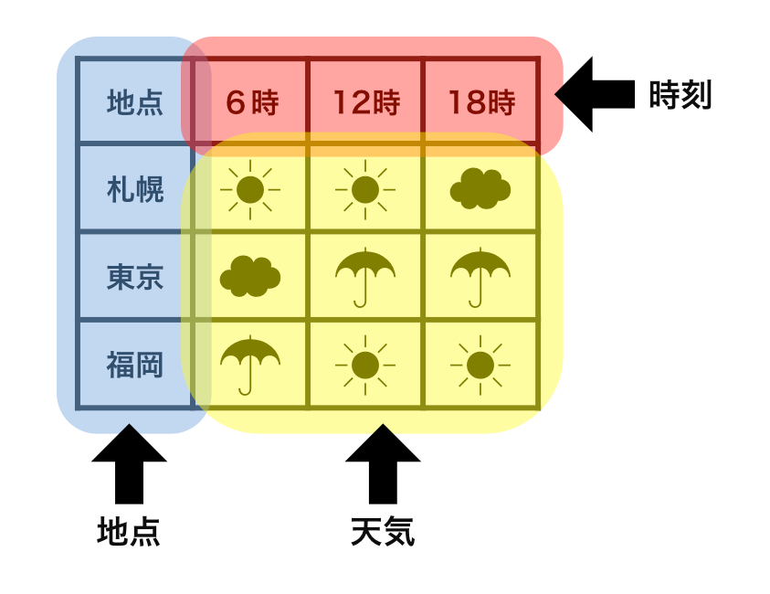
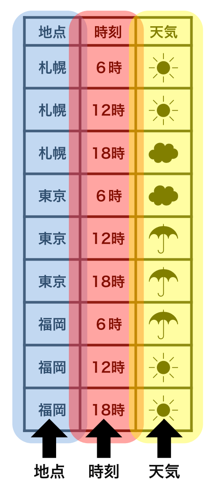

# tidyデータとは？


きれいに揃ったデータがtidyデータと称される．
詳しくはhttps://id.fnshr.info/2017/01/09/tidy-data-intro/


## 非tidyデータの一例

 - 変数（地点・時刻・天気）の並びが整然としていない
 - 人間にはわかりやすくとも，データ解析には適さない

```{r}

```


## tidyデータの一例

 - 変数が整然と並ぶ


```{r}

```


# tidy verse

 - R studio開発者らによって開発された一連のパッケージ．
 - tidyデータの諸変換（tidyr），データの操作(dplyr，purrr)，<br>グラフ作成（ggplot），等が含まれる．
 - 特に，データ「群」ごとの解析は<br>エクセルではなかなか実現できない機能のひとつ．

```{r}
library(tidyverse)
```

# データ群の計算例①：データ群の作成

 - たとえば，変数supp, dose，lenをもつデータToothGrowthを考える．
 - suppはカテゴリで，OJとVCがそれぞれ30データ含まれる．カテゴリ毎に計算を行いたい場合，次の様にグループ化できると都合が良い．


## グループ化前

```{r}
data("ToothGrowth")
head(ToothGrowth)
```

イメージ

|supp | dose|  len|
|:----|----:|----:|
|VC   |  0.5|  4.2|
|$\vdots$|$\vdots$|$\vdots$|
|VC   |  0.5| 11.5|
|OJ   |  0.5| 15.2|
|$\vdots$|$\vdots$|$\vdots$|
|OJ   |  2.0| 23.0|


## グループ化後

```{r}

grouped_TG <- ToothGrowth %>%
  dplyr::group_by(supp) %>%
  tidyr::nest() 

head(grouped_TG)
```


イメージ

|supp | dose|  len|
|:----|----:|----:|
|VC   |  30個のデータ|  30個のデータ|
|OJ   |  30個のデータ| 30個のデータ|


# データ群の計算例② ：データ群ごとに計算する

 - グループ化したデータgrouped_TGを用意した<br>（計算詳細はソースファイルを見よ）．
 - データ群ごとに，あらゆる計算が可能．
 - たとえば，lenの平均，中央値，10パーセンタイル値を求める．


```{r}
grouped_TG %>%
  dplyr::mutate(
    len_ave = purrr::map_dbl(data, ~mean(.x$len)),
    len_med = purrr::map_dbl(data, ~median(.x$len)),
    len_qt10 = purrr::map_dbl(data, ~quantile(.x$len, 0.1))
    )
```

# 大量のデータを効率的に処理可能

 - エクセルのデータ量上限は約100万行
 - Rであれば，メモリの許す限りのデータ（今の標準的なPC性能で数十億行×数十列程度）を一度に処理可能．
 - 「データ群」の活用で，大規模データでも見通しの良い計算が可能．
 - なお，特殊なパッケージを使えば，より大量のデータ<br>（狭義のビッグデータ）も処理可能．

# その他，tidyverseに関連する特殊データ処理

以下の処理は，エクセルではできないか，曖昧に処理されている．

 - **forcats**：カテゴリ変数の処理
 - **stringr**：文字列の処理，検索や置換
 - **lubridate**：日付・時刻の処理
 - **sf**：GISデータの処理